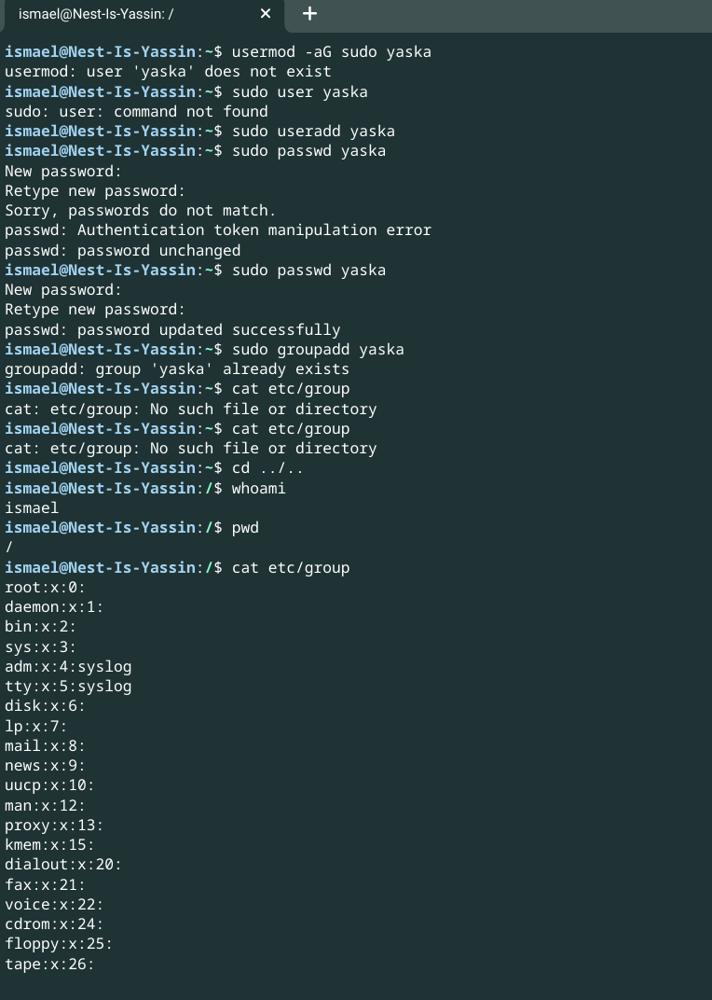

# Cron jobs
Introduction:
There might be processes that you want to execute on a regular schedule. For example, you might want to write the available disk space to a log file every hour. Or maybe you want to check for system updates every 2nd day of the month.

These kinds of jobs can be automated using Cron jobs.

Requirements:
Your Linux machine

Exercise:

# Create a Bash script that writes the current date and time to a file in your home directory.

ismael@Nest-Is-Yassin:~$ ls
scripts  techgrounds  time.sh
ismael@Nest-Is-Yassin:~$ cd time.sh
ismael@Nest-Is-Yassin:~/time.sh$ cat time.sh
#!/bin/bash
echo `date` >> date.txt
ismael@Nest-Is-Yassin:~/time.sh$ nano time.sh
ismael@Nest-Is-Yassin:~/time.sh$ ls
time.sh
ismael@Nest-Is-Yassin:~/time.sh$ nano time.sh
ismael@Nest-Is-Yassin:~/time.sh$ chmod u+x time.sh
ismael@Nest-Is-Yassin:~/time.sh$ ./time.sh
ismael@Nest-Is-Yassin:~/time.sh$ ls
date.txt  time.sh
ismael@Nest-Is-Yassin:~/time.sh$ cat date.txt
Fri May 6 14:07:39 UTC 2022
ismael@Nest-Is-Yassin:~/time.sh$ 

# Register the script in your crontab so that it runs every minute.

# Create a script that writes available disk space to a log file in ‘/var/logs’. Use a cron job so that it runs weekly.

# source
https://ostechnix.com/a-beginners-guide-to-cron-jobs/

https://www.cyberciti.biz/faq/how-to-run-cron-job-every-minute-on-linuxunix/

https://linuxize.com/post/how-to-add-user-to-group-in-linux/

https://linuxize.com/post/how-to-add-user-to-sudoers-in-ubuntu/

### Overcome challanges
My laptop crushed so I was late with this assignment and i will need to rewrite the steps of the answers again in a little more detailed if i had more time.

### Results

