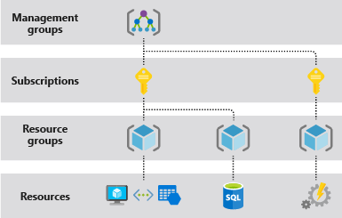

1. Blob Rehydration;
changing the archive data in blob storage and making it readable, via changing tier of the blob from cold to hot.

2. Azure Information Protection:

Protects Documents and Emails that a company shares with the public by applying labels.

3. User Defined Routes(UDR);

Change the way traffic is routed in a virtual network.

4. Initiative definition;

Is a collection of policy definitions that are tailored towards achieving singular overarching goal. So it 
Simplifies managing and assigning policy definition.

5. Azure AD Identity Secure Score;

Helps to identify the current identity practices and advices improvements.

6. IT Service Management Connector;

Solution enables you to provide faster resolution of incidents by bringing service desk and monitoring data together. It provides a bi-directional connection between Azure and supported ITSM tools ServiceNow, System Center Service Manager, Provance and Cherwell.

7. Microsoft Defender for Identity;

- Monitor users, entity behavior, and activities with learning-based analytics(user login/logout)
- Protect user identities and credentials stored in Active Directory(Monitor Active Directory user account changes)
- Identify and investigate suspicious user activities and advanced attacks throughout the kill chain
- Provide clear incident information on a simple timeline for fast triage(Monitor machine account).

8. Azure Security center;

Supports virtual machines and servers on different types of hybrid environments(SQL, storage services etc):

- Only Azure
- Azure and on-premises
- Azure and other clouds
- Azure, other clouds, and on-premise

9. User Risk policy;

Prompts users if credentials are compromised.

10. Sign in risk policy;

Identify suspicious login attempts.

11. Conditional access;

Provides the access for group of users and helps in managing efficiently.

12. 

