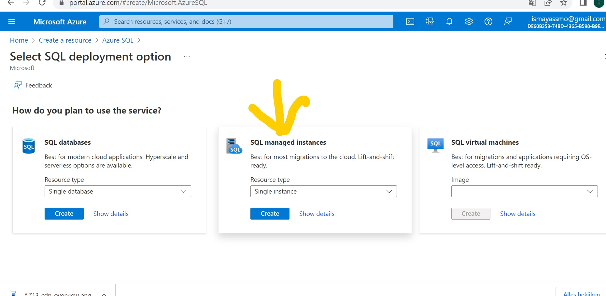
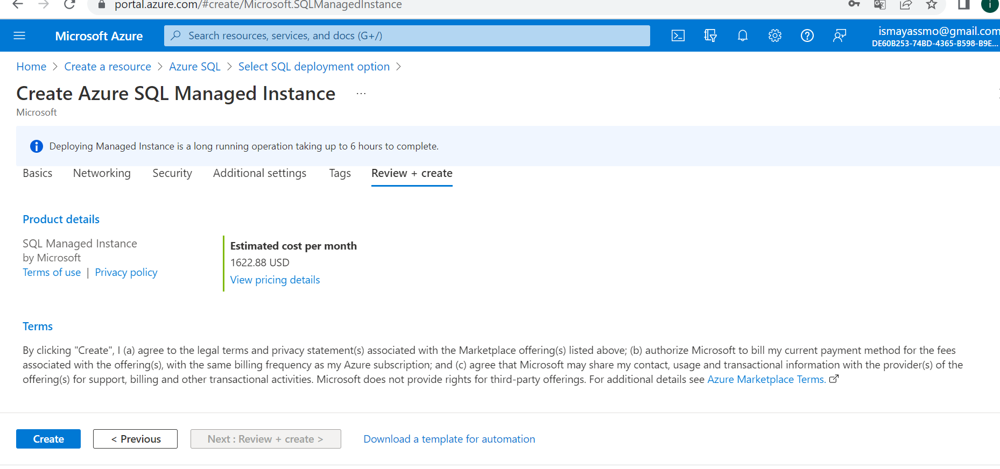
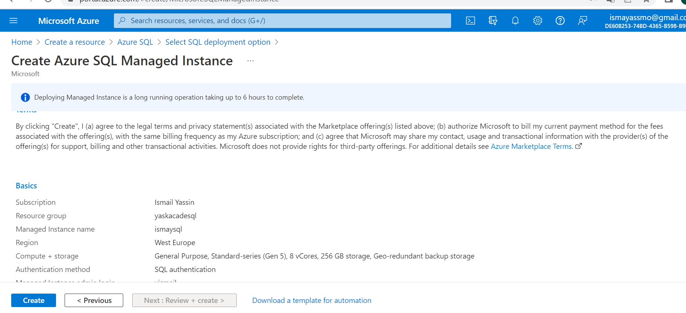
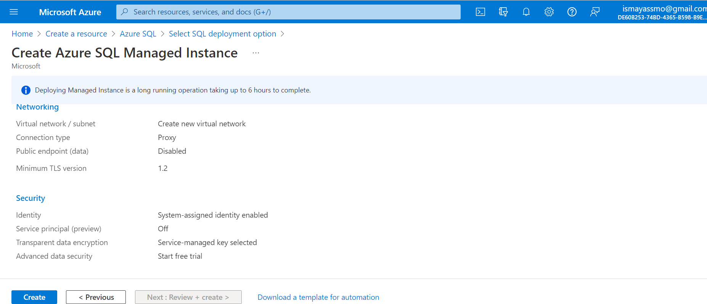
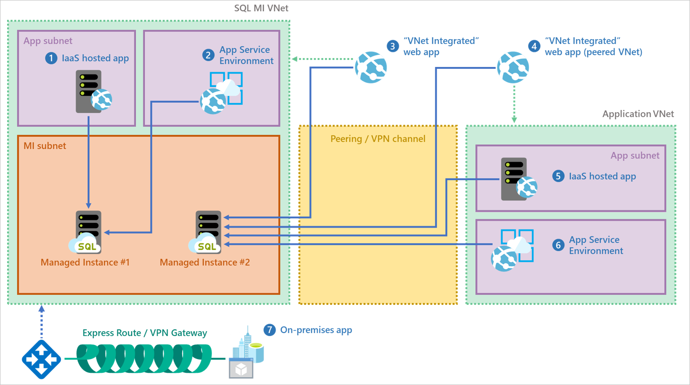
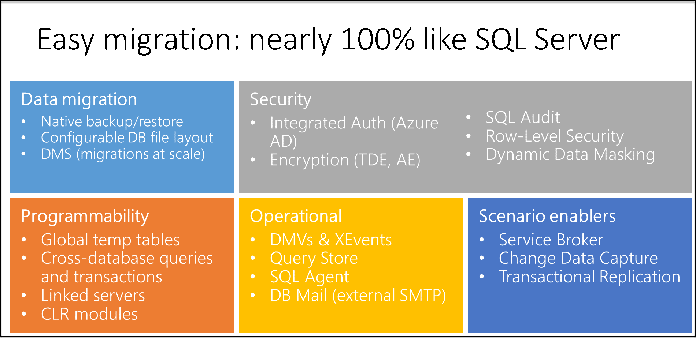

### 13.5 Azure Database (+ managed instance):

1. **Azure SQL Database** is a fully managed platform as a service (PaaS) database engine that handles most of the database management functions such as upgrading, patching, backups, and monitoring without user involvement. Azure SQL Database is always running on the latest stable version of the SQL Server database engine and patched OS with 99.99% availability.

- It enables you to process both relational data and non-relational structures, such as graphs, JSON, spatial, and XML.

2. **A SQL Managed Instance** is created in its own VNet with no public endpoint. To access client applications, you can create a virtual machine in the same VNet (with a different subnet) with a point-to-site VPN connection to the VNet from the client computer using one of these quickstarts:

- Enable public endpoint on your SQL Managed Instance to access your data directly from your environment.
- Create Azure Virtual Machine in the SQL Managed Instance VNet for client application connectivity, including SQL Server Management Studio.
- Set up a point-to-site VPN connection to your SQL Managed Instance from your client computer running SQL Server Management Studio and other client connection applications. This is one of two other options for connectivity to your SQL Managed Instance and its VNet. The other option is to use an express route over a site-to-site connection from your local network.

### Where can I find this service in the console?

-   Via Azure SQL, you can choose to create a Managed Instance. But it is quite expensive(also it might take 6hours to complete) to play around with this managed SQL, that's why i did not create it. 

     

### How do I enable this service?
        
- After configuring the managed instance, a VNET is created with the configured computing power and storage. After "Create" the Managed Instance is deployed and the service is actually already on. 

    

    

    

### How can I link this service to other resources?

- First of all there are various connectivity options for the applications to the managed SQL.

    - Link feature in Azure SQL Managed Instance connects the SQL Servers hosted anywhere to SQL Managed Instance, providing hybrid flexibility and database mobility. 

    

    - So the managed SQL can be linked with other resources when doing data migration for example. You can use Azure AD, DNS and Query store.

    The following diagram outlines surface area compatibility in SQL Managed Instance.

    

### Challenges Overcame
Learning about managed SQL and how to link with other Azure resources.    

# Sources

https://docs.microsoft.com/en-us/azure/azure-sql/managed-instance/sql-managed-instance-paas-overview?view=azuresql

https://docs.microsoft.com/en-us/azure/azure-sql/database/sql-database-paas-overview?view=azuresql

https://docs.microsoft.com/en-us/azure/azure-sql/managed-instance/instance-create-quickstart?view=azuresql

https://docs.microsoft.com/en-us/azure/azure-sql/managed-instance/sql-managed-instance-paas-overview?view=azuresql

https://docs.microsoft.com/en-us/azure/azure-sql/managed-instance/managed-instance-link-feature-overview?view=azuresql
