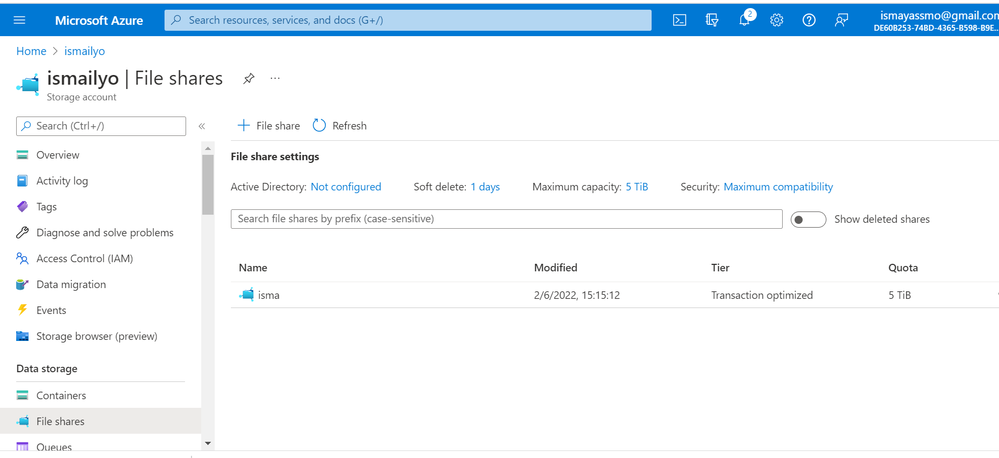

# Files,AppServices,CDN,DNS, Database:

# Study:

1. App Service 

    - What is App Service for?

        Is Platform as a Service (PaaS) that enables you to build and host web apps, mobile back ends, and RESTful APIs in the programming language of your choice without managing infrastructure.

        The app service offers a range of plans to meet the needs of your app. Azure App Service runs web and API apps at scale and works seamlessly with other first or third party applications/integrations to meet the app solution requirements you envision.

        To configure an App Service, start with an App Service subscription:

    1. It is essentially the scope and scale of what your application will have available.
        It determines how much storage space it has, how much CPU and memory, etc.
    2. It's just like the billing model and feature set for the app services.
    3. You can have multiple applications installed in the App Service Plan.
    4. The App Service will run your application.
    5. The web apps app service has deployment slots. This allows you to create a
        instance of your application, meaning you can have multiple versions of your website and switch between them when you deploy them.

    -   How does App Service fit / replace App Service in a classic setting?

        -  In the classic setting of deployment model, resource states, policies, and tags are all managed individually. If you need to delete resources, you do so individually. This quickly becomes a management challenge.

        - Azure app service is different from hosting on your own on-premise server(classic setting). Because with on-premise web hosting, you or your organisation is reponsible for managing pretty much everything (from storage to networking equipment). 

        - While in Azure app service everything else is managed by Azure. So you don't have to worry about any of the things like, managing the network or underlying infrastructure.

        - Meet rigorous, enterprise-grade performance, security, and compliance requirements by using the fully managed platform for your operational and monitoring tasks.

        - Cloud Services(classic) is now deprecated for new customers and will retire on August 31st, 2024 for all customers. Cloud Services (extended support) with Azure Resource Manager is the recommended replacement.

    -   How can I combine App Service with other services?

        - Authenticate users with Azure Active Directory or any of the external authentication providers like Google, Facebook, Twitter, or Microsoft.

        - Also host a custom Windows or Linux container in App Service. So, if you want to, you can dockerize your app and host it in App Service. You can also run multi-container apps with Docker Compose.

        - With App Service you can still access data on your on-premise servers using Hybrid Connections and Azure Virtual Networks.

    -    What is the difference between App Service and other similar services?

            - Elastic beanstalk; Quickly deploy and manage applications in the AWS cloud. According to reviewers(g2.com), they found that AWS Elastic Beanstalk was easier to use and do business with overall. However, reviewers preferred the ease of set up with Azure App Service, along with administration.

            - Google App engine; Build web applications on the same scalable systems that power Google applications. When assessing the two solutions, reviewers found Azure App Service easier to use and set up. However, Google App Engine is easier to administer. Reviewers felt that Azure App Service meets the needs of their business better than Google App Engine.

            - Heroku;  Heroku is a service that enables companies to spend their time developing and deploying apps. When assessing the two solutions, reviewers found Salesforce Heroku easier to use, administer, and do business with overall. However, reviewers preferred the ease of set up with Azure App Service.

2. Content Delivery Network (CDN) 

    - What is CDN ?

    It puts stuff like blobs and other static content in a cache(increase the speed of cloud services) on edge servers. The process involves placing the data at strategically chosen locations  and caching it(in point of presence). As a result, it provides maximum bandwidth for its delivery to users. 

    
            
    -   How does CDN / replace CDN in a classic setting?

        -   CDN provides better performance and improved user experience for end users, especially when using applications in which multiple round-trips are required to load content. In comparison to a classical setting where some VM are located far from end users thus creating high latency. 

    -   How can I combine CDN with other services?

        -   You can integrate an Azure storage account with Azure CDN. Also you can add Azure Content Delivery Network (CDN) to a web app in Azure App Service. 

    -   What is the difference between CDN and other similar services?

        -  CDN and Web Hosting seem to be similar, but they are totally two different concepts. Web Hosting is hosting your content of your website in a server. There are different hosting plans available these days like shared hosting, VPS (Virtual Private Hosting), Dedicated Hosting and Cloud Hosting.

        -   Mostly, web content are hosted in a single server, but CDN content will be spread across the world, in multiple hosted environment.

3. Azure DNS 

    -   What is Azure DNS for?
     
     Is a cloud service that allows you to host and manage domain name system (DNS) domains, also known as DNS zones. It works like a phonebook, but here is where computers  resolve domain names to IP addresses.
     For example, www.tailwindtraders.com (a host record) mapping to a specific IP address (40.71.177.34).
    

    -   How does Azure DNS / replace Azure DNS in a classic setting?

        - Traditionally when a DNS service is hosted on a server running Windows Server or Linux and a DNS zone gets delegated to that server. But DNS zones in Azure DNS are hosted across Azure's global network of DNS name servers. These servers use Anycast networking so that queries for DNS zone data will be answered by the DNS server closest to the querying client. 

    -   How can I combine Azure DNS with other services?

        - Azure Firewall DNS proxy can be used as DNS forwarder for On-premises workloads and Virtual network workloads using a DNS forwarder.

        - Use Azure DNS for private domains.  

    -   What is the difference between Azure DNS(Small-Business) and other similar services?

        -   Route 53; for mid-market

        - Cloudflare DNS; Small-Business

        - Google Cloud DNS; Small-Business

        - GoDaddy; Small-Business

# Task:

1. Azure Files / EFS(AWS)

    -   Where can I find this service in the console?
        
        - You can find Azure File share under a tab in your Storage account. See below picture.

        
        
       

    -   How do I enable this service?

         -  You can use Azure Files when you have created a Storage account. 
        The storage account is already active, but there is nothing on it. Azure Documentation expalined that, Azure Files is really put into use when I upload a file in it.
        Below I have an example. I have uploaded a file in Azure Files share. 

      

    -   How can I link this service to other resources?

        -  You can link your file share to different services. You can share the file and connect to your current OS. For example, on-premises machines, which can import and use the files. You can also connect the File share to a VM, which is made accessible via a private endpoint and can then be connected to the location that needs access. The configurations must be fine-tuned, which ensures that the files are available from both endpoints. Finally you can also connect it to the storage account.  

2. Azure Database (+ managed instance):

    Azure SQL Database is a fully managed platform as a service (PaaS) database engine that handles most of the database management functions such as upgrading, patching, backups, and monitoring without user involvement. Azure SQL Database is always running on the latest stable version of the SQL Server database engine and patched OS with 99.99% availability.

    It enables you to process both relational data and non-relational structures, such as graphs, JSON, spatial, and XML.

    A SQL Managed Instance is created in its own VNet with no public endpoint. To access client applications, you can create a virtual machine in the same VNet (with a different subnet) with a point-to-site VPN connection to the VNet from the client computer using one of these quickstarts:

- Enable public endpoint on your SQL Managed Instance to access your data directly from your environment.
- Create Azure Virtual Machine in the SQL Managed Instance VNet for client application connectivity, including SQL Server Management Studio.
- Set up a point-to-site VPN connection to your SQL Managed Instance from your client computer running SQL Server Management Studio and other client connection applications. This is one of two other options for connectivity to your SQL Managed Instance and its VNet. The other option is to use an express route over a site-to-site connection from your local network.

    -   Where can I find this service in the console?

        -   Via Azure SQL, kan je kiezen om een Managed Instance aan te maken.  
        
    -   How do I enable this service?

    -   How can I link this service to other resources?

 # Sources
     

 https://www.pragimtech.com/blog/azure/what-is-azure-app-service/

 https://www.g2.com/compare/aws-elastic-beanstalk-vs-azure-app-service

 https://www.g2.com/compare/azure-app-service-vs-google-app-engine-vs-salesforce-heroku

 https://www.heroku.com/what#:~:text=Heroku%20is%20part%20of%20the,enables%20full%2Dcycle%20CRM%20engagement

 https://www.g2.com/compare/azure-app-service-vs-salesforce-heroku

 https://docs.microsoft.com/en-us/azure/cdn/

https://www.tutorialspoint.com/microsoft_azure/microsoft_azure_cdn.htm

https://www.parkmycloud.com/blog/azure-classic-vs-arm/

https://docs.microsoft.com/en-us/azure/cdn/cdn-add-to-web-app

https://www.differencebetween.com/difference-between-content-delivery-network-cdn-and-vs-web-hosting-servers/

https://docs.microsoft.com/en-us/learn/modules/intro-to-azure-dns/2-what-is-azure-dns

https://www.g2.com/compare/amazon-route-53-vs-azure-dns-vs-cloudflare-dns-vs-google-cloud-dns

https://docs.microsoft.com/en-us/azure/storage/files/storage-files-introduction

https://docs.microsoft.com/en-us/azure/storage/files/storage-files-quick-create-use-windows

https://docs.microsoft.com/en-us/azure/azure-sql/database/sql-database-paas-overview?view=azuresql
