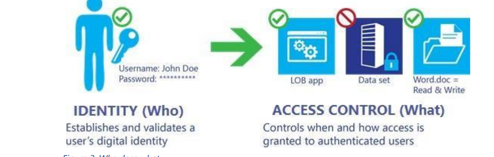

# Shared Responsibility Model

In the cloud many of the responsibilities from physical security of the data center to the security and encryption of your data, but also the maintenance and management of the building are taken over by the cloud solution provider(CSP).

So as a customer you can rent the infrastructure without having to worry about it.

However, as a customer, you are still responsibile for access control to data and software, encryption of data at rest and data in transit.

Therefore CSP (Azure) manages security of the cloud like:

- Disk Storage
- Database
- Networking
- Global infrastructure (regions,AZ, region pairs)

While security in the cloud is the responsibility of the customer like:

- Data to servers
- Turn on encryption
- configuration of an identity provider, configuration of administrative services, establishing and configuration of user identities, and
implementation of service access controls

The Cloud solution provider(CSP) extra offers extra services with which you can manage your own responsibilities more easily.

# Sources

https://azure.microsoft.com/mediahandler/files/resourcefiles/shared-responsibility-for-cloud-computing/Shared%20Responsibility%20for%20Cloud%20Computing-2019-10-25.pdf

