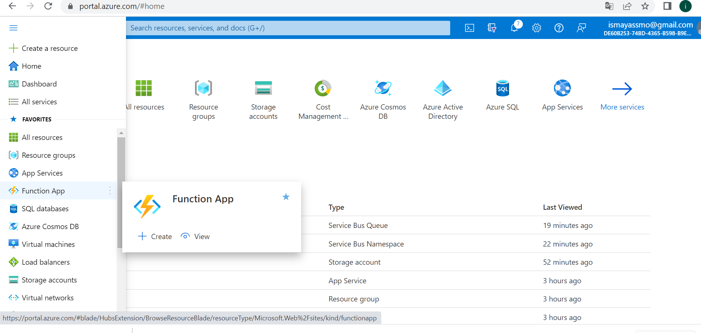
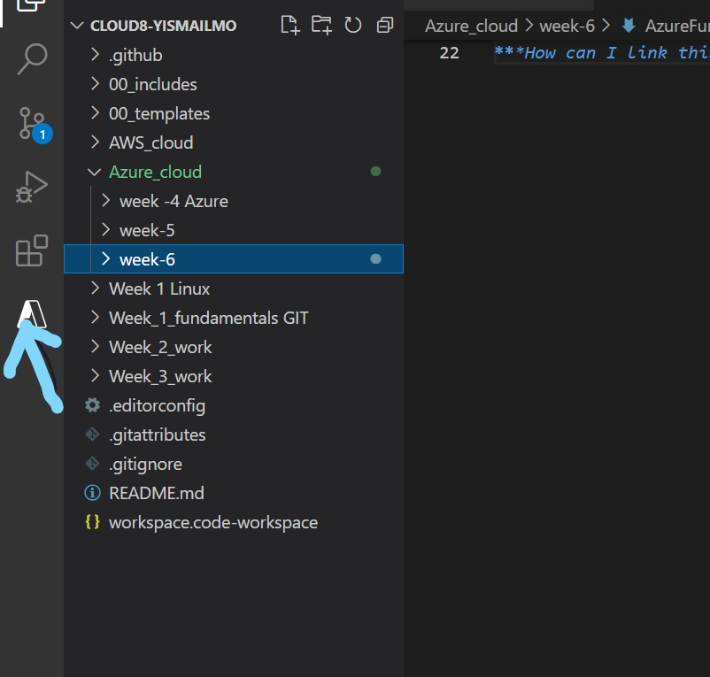
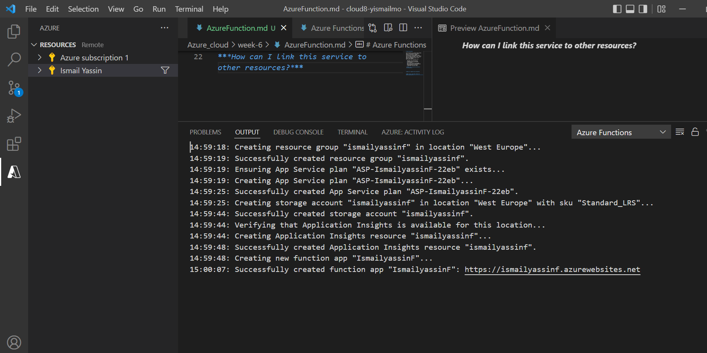
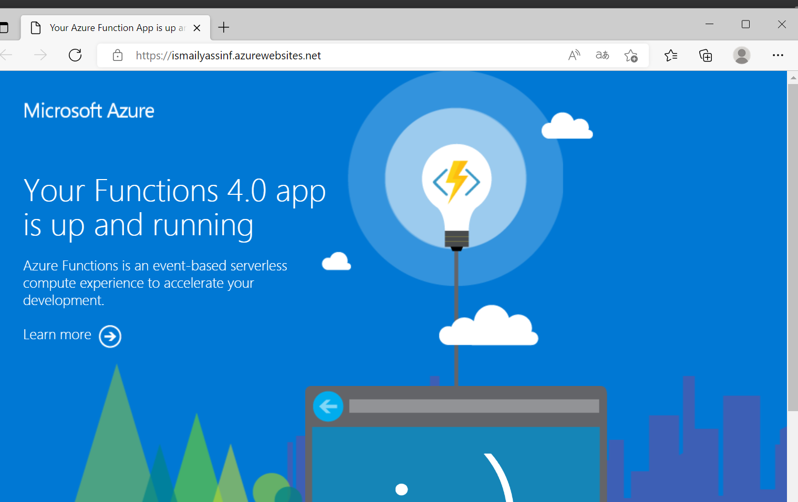
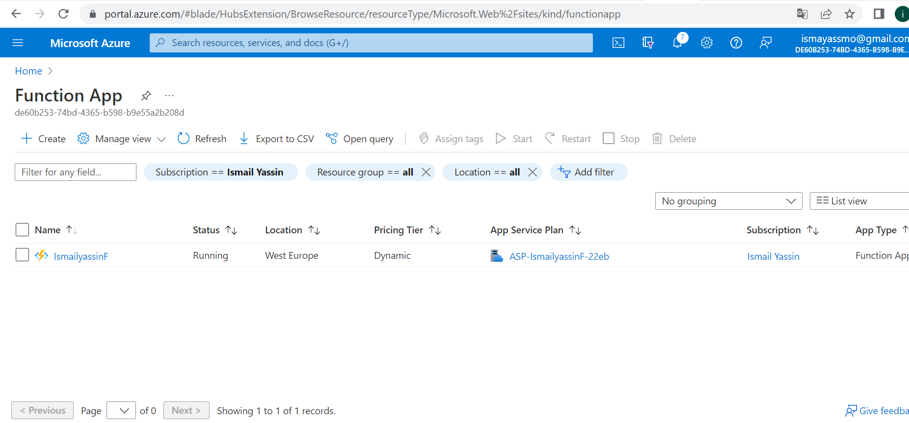
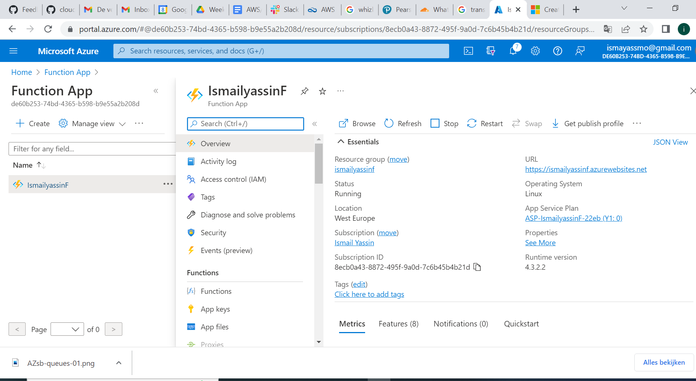

# Azure Functions

Azure Function is a service that allows you to run activated code without having to provision or manage infrastructure (like Lambda in AWS). You can easily designate an SQL and the type of trigger you want to run, which then syncs seamlessly with a text editor like VSCODE.
You can use Azure Functions for:

 - Reminders and notifications.
 - Scheduled tasks and messages.
 - File handling.
 - Data or data stream processing.
 - Run backup tasks in the background.
 - Making backend calculations.
 - Lightweight web APIs (MVPs).

 ***Where can I find this service in the console?***

Location in Azure portal

location in VScode

Download the Azure Function extension, then you will see the Azure function;

 
***How do I enable this service?***

Sign in to the Azure in VScode for Azure function under resources;

Function is up and running;

***How ​​can I link this service to other resources?***

it  usually depends on what you'd like to use it for, e.g. Scheduled Tasks, Reminders, Notifications, and Lightweight Web API are examples of how to use Functions. You choose your preferred programming language and create a function. Via the Azure portal you can review what you have created and published to the Azure Portal.

# Sources

https://docs.microsoft.com/en-us/azure/azure-functions/functions-overview

https://docs.microsoft.com/en-us/azure/azure-functions/create-first-function-vs-code-python
