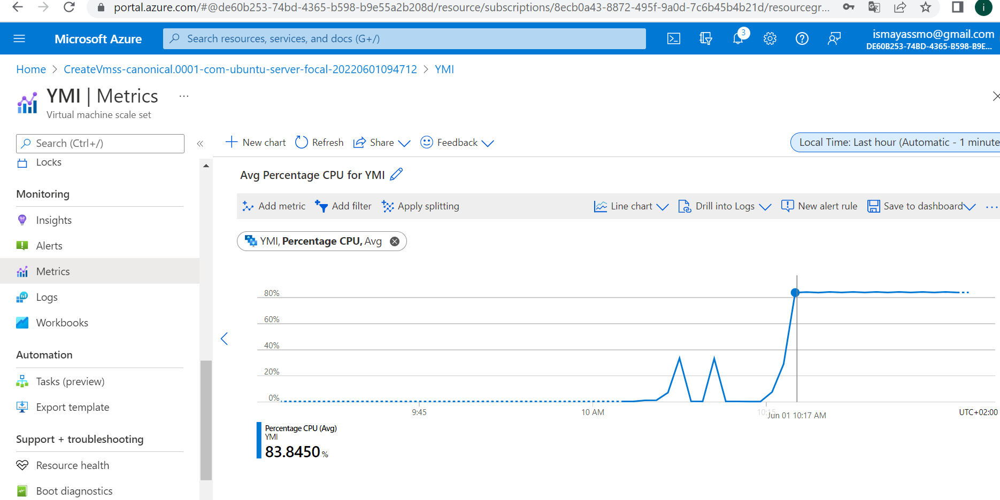

# Azure Monitor

Helps you understand how your applications are performing and proactively identify issues affecting them and the resources they depend on. In order to maximize the availability and performance of a company's applications and services.

### Key terminologies

- Metric

Metrics are numerical data that define properties like CPU usage, memory usage, network usage, etc. These are real-time measurements stored in intervals

- Logs;

Events, performance data, traces, etc. related to specific applications are stored in Azure Monitor logs.

Log data collected by Azure Monitor can be analyzed with queries to quickly retrieve, consolidate, and analyze collected data.

Azure Monitor uses a version of the Kusto query language (suitable for simple log queries)

### How do you use Monitor and what information does it collect?

1. Response and Integration;

A good monitoring service should also be able to respond to critical situations. Azure Monitor can send alerts and can be used to automate tasks based on the data it collects.

2. Alerts;

Alerts in Azure Monitor Alerts can notify about critical conditions and can start actions to solve the issue. Alerts based on metrics give real-time notifications and based on logs can alert for complex logic between multiple sources.

In the Azure Load Balancer (ALB) & Auto Scaling assignment I also used the Azure Monitor to see the metrics of the CPU ussage of my instances.

# Sources

https://docs.microsoft.com/en-au/azure/azure-monitor/overview

https://intellipaat.com/blog/what-is-azure-monitor/
