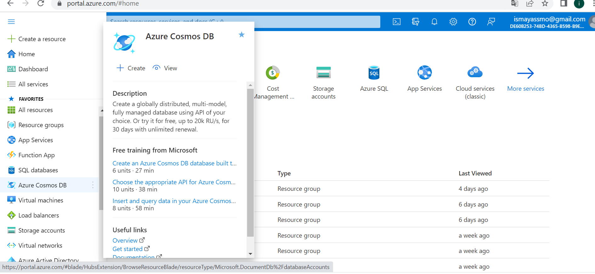

# Azure Cosmos DB:

Is a fully managed NoSQL database for app development.

Cosmos DB is designed to provide low latency, elastic throughput scalability, well-defined semantics (using no fixed SQL) for data consistency, and high availability.

Azure Cosmos DB is used within web and mobile applications and is well-suited for modeling social interactions, integrating with third-party services, and building rich personalized experiences.

***Where can I find this service in the console?***

- In the Azure portal there is a separate tab for Azure CosmosDB.

# Sources

https://docs.microsoft.com/en-us/azure/cosmos-db/introduction

