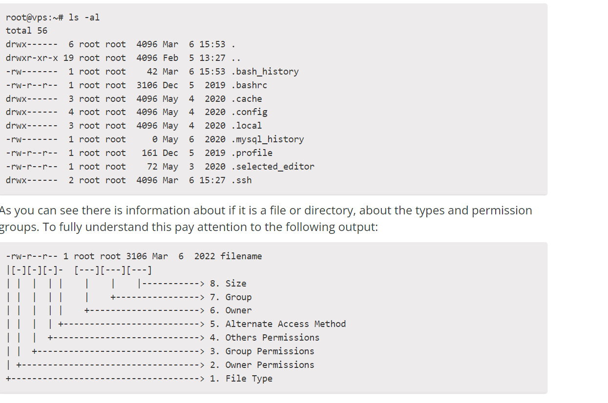
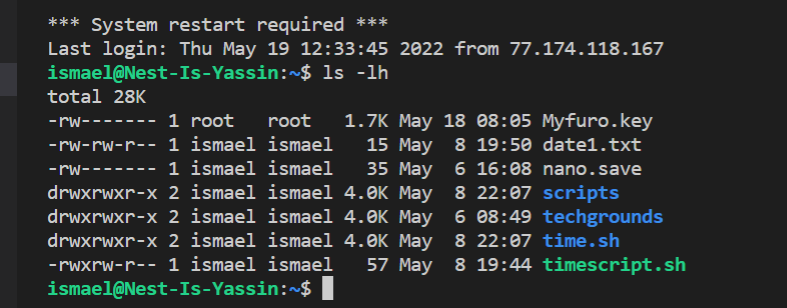

## File permissions

Linux system has three types of file ownerships:

1. user is the creator of the file thus the owner of the file. So the user can create, delete or modify the file he/she created.

2. Group contains multiple users with the same access permission to a file (create, delete or modify the file).

3. Other does not create a file and does not belong to a group like creating a role

You can view a file’s permissions by creating a long listing. A file’s permissions, as well as its owner and group, can be changed as well.

Any user listed in /etc/passwd can be assigned as owner of a file.

Any group listed in /etc/group can be assigned as the group of a file.

## Key terminology

- Every file in Linux contains a set of permissions. There are separate permissions for 

- rwx: reading, writing, and executing files.

- rw means that you read and write

- /etc/psswd or /etc/group is used to locally manage users & group.

- chgrp for changing the group owner

- chown for changing the owner of a file

- rw is for read and write (edit) permission

- r- is for only read permission

- ls -l command, ten characters are displayed before user owner and group. First character tells us about the type of the file.

## Exercise
Create a text file.

# Who is the file’s owner and group? 

# What kind of permissions does the file have?
-rw-rw-r-- 1 ismael ismael 30 May  5 20:49 denbosch.txt

# Make a long listing to view the file’s permissions.

ismael@Nest-Is-Yassin:~/techgrounds$ cat /etc/passwd
root:x:0:0:root:/root:/bin/bash
daemon:x:1:1:daemon:/usr/sbin:/usr/sbin/nologin
bin:x:2:2:bin:/bin:/usr/sbin/nologin
sys:x:3:3:sys:/dev:/usr/sbin/nologin
sync:x:4:65534:sync:/bin:/bin/sync
games:x:5:60:games:/usr/games:/usr/sbin/nologin
man:x:6:12:man:/var/cache/man:/usr/sbin/nologin
lp:x:7:7:lp:/var/spool/lpd:/usr/sbin/nologin
mail:x:8:8:mail:/var/mail:/usr/sbin/nologin
news:x:9:9:news:/var/spool/news:/usr/sbin/nologin
uucp:x:10:10:uucp:/var/spool/uucp:/usr/sbin/nologin
proxy:x:13:13:proxy:/bin:/usr/sbin/nologin
www-data:x:33:33:www-data:/var/www:/usr/sbin/nologin
backup:x:34:34:backup:/var/backups:/usr/sbin/nologin
list:x:38:38:Mailing List Manager:/var/list:/usr/sbin/nologin
irc:x:39:39:ircd:/var/run/ircd:/usr/sbin/nologin
gnats:x:41:41:Gnats Bug-Reporting System (admin):/var/lib/gnats:/usr/sbin/nologin
nobody:x:65534:65534:nobody:/nonexistent:/usr/sbin/nologin
systemd-network:x:100:102:systemd Network Management,,,:/run/systemd:/usr/sbin/nologin
systemd-resolve:x:101:103:systemd Resolver,,,:/run/systemd:/usr/sbin/nologin
systemd-timesync:x:102:104:systemd Time Synchronization,,,:/run/systemd:/usr/sbin/nologin
messagebus:x:103:106::/nonexistent:/usr/sbin/nologin
syslog:x:104:110::/home/syslog:/usr/sbin/nologin
_apt:x:105:65534::/nonexistent:/usr/sbin/nologin
tss:x:106:111:TPM software stack,,,:/var/lib/tpm:/bin/false
uuidd:x:107:112::/run/uuidd:/usr/sbin/nologin
tcpdump:x:108:113::/nonexistent:/usr/sbin/nologin
sshd:x:109:65534::/run/sshd:/usr/sbin/nologin
landscape:x:110:115::/var/lib/landscape:/usr/sbin/nologin
pollinate:x:111:1::/var/cache/pollinate:/bin/false
systemd-coredump:x:999:999:systemd Core Dumper:/:/usr/sbin/nologin
ismael:x:1000:1000::/home/ismael:/bin/bash
lxd:x:998:100::/var/snap/lxd/common/lxd:/bin/false
yaska:x:1001:1001::/home/yaska:/bin/sh

# Make the file executable by adding the execute permission (x).

ismael@Nest-Is-Yassin:~/techgrounds$ ls -lh
total 20K
-rw-r--r-- 1 root   root   40 May  4 09:27 Imani.txt
-rw-rw-r-- 1 ismael ismael 30 May  5 20:49 denbosch.txt
-rw-rw-r-- 1 ismael ismael 47 May  4 13:33 ismail.txt
-rw-rw-r-- 1 ismael ismael 22 May  4 14:18 samen.txt
-rw-rw-r-- 1 ismael ismael 19 May  4 14:21 techgrounds.txt
ismael@Nest-Is-Yassin:~/techgrounds$ ls -lh denbosch.txt
-rw-rw-r-- 1 ismael ismael 30 May  5 20:49 denbosch.txt
ismael@Nest-Is-Yassin:~/techgrounds$ chmod u+x denbosch.txt
ismael@Nest-Is-Yassin:~/techgrounds$ ls -l
total 20
-rw-r--r-- 1 root   root   40 May  4 09:27 Imani.txt
-rwxrw-r-- 1 ismael ismael 30 May  5 20:49 denbosch.txt
-rw-rw-r-- 1 ismael ismael 47 May  4 13:33 ismail.txt
-rw-rw-r-- 1 ismael ismael 22 May  4 14:18 samen.txt
-rw-rw-r-- 1 ismael ismael 19 May  4 14:21 techgrounds.txt
ismael@Nest-Is-Yassin:~/techgrounds$ sudo chgrp stad denbosch.txt
chgrp: invalid group: ‘stad’
ismael@Nest-Is-Yassin:~/techgrounds$ sudo groupadd kruiskamp
ismael@Nest-Is-Yassin:~/techgrounds$ ls -l
total 20
-rw-r--r-- 1 root   root   40 May  4 09:27 Imani.txt
-rwxrw-r-- 1 ismael ismael 30 May  5 20:49 denbosch.txt
-rw-rw-r-- 1 ismael ismael 47 May  4 13:33 ismail.txt
-rw-rw-r-- 1 ismael ismael 22 May  4 14:18 samen.txt
-rw-rw-r-- 1 ismael ismael 19 May  4 14:21 techgrounds.txt
ismael@Nest-Is-Yassin:~/techgrounds$ sudo chgrp kruiskamp denbosch.txt
ismael@Nest-Is-Yassin:~/techgrounds$ ls -l
total 20
-rw-r--r-- 1 root   root      40 May  4 09:27 Imani.txt
-rwxrw-r-- 1 ismael kruiskamp 30 May  5 20:49 denbosch.txt
-rw-rw-r-- 1 ismael ismael    47 May  4 13:33 ismail.txt
-rw-rw-r-- 1 ismael ismael    22 May  4 14:18 samen.txt
-rw-rw-r-- 1 ismael ismael    19 May  4 14:21 techgrounds.txt
ismael@Nest-Is-Yassin:~/techgrounds$ sudo gr
grep       gresource  groff      grog       grops      grotty     groupadd   groupdel   groupmems  groupmod   groups     growpart   grpck      grpconv    grpunconv  
ismael@Nest-Is-Yassin:~/techgrounds$ sudo groupadd kruiskamp
groupadd: group 'kruiskamp' already exists
ismael@Nest-Is-Yassin:~/techgrounds$ ls -l
total 20
-rw-r--r-- 1 root   root      40 May  4 09:27 Imani.txt
-rwxrw-r-- 1 ismael kruiskamp 30 May  5 20:49 denbosch.txt
-rw-rw-r-- 1 ismael ismael    47 May  4 13:33 ismail.txt
-rw-rw-r-- 1 ismael ismael    22 May  4 14:18 samen.txt
-rw-rw-r-- 1 ismael ismael    19 May  4 14:21 techgrounds.txt
ismael@Nest-Is-Yassin:~/techgrounds$ 

# Remove the read and write permissions (rw) from the file for the group and everyone else, but not for the owner. Can you still read it?

ismael@Nest-Is-Yassin:~/techgrounds$ sudo groupadd kruiskamp
ismael@Nest-Is-Yassin:~/techgrounds$ ls -l
total 20
-rw-r--r-- 1 root   root   40 May  4 09:27 Imani.txt
-rwxrw-r-- 1 ismael ismael 30 May  5 20:49 denbosch.txt
-rw-rw-r-- 1 ismael ismael 47 May  4 13:33 ismail.txt
-rw-rw-r-- 1 ismael ismael 22 May  4 14:18 samen.txt
-rw-rw-r-- 1 ismael ismael 19 May  4 14:21 techgrounds.txt
ismael@Nest-Is-Yassin:~/techgrounds$ sudo chgrp kruiskamp denbosch.txt
ismael@Nest-Is-Yassin:~/techgrounds$ ls -l
total 20
-rw-r--r-- 1 root   root      40 May  4 09:27 Imani.txt
-rwxrw-r-- 1 ismael kruiskamp 30 May  5 20:49 denbosch.txt
-rw-rw-r-- 1 ismael ismael    47 May  4 13:33 ismail.txt
-rw-rw-r-- 1 ismael ismael    22 May  4 14:18 samen.txt
-rw-rw-r-- 1 ismael ismael    19 May  4 14:21 techgrounds.txt
ismael@Nest-Is-Yassin:~/techgrounds$ sudo gr
grep       gresource  groff      grog       grops      grotty     groupadd   groupdel   groupmems  groupmod   groups     growpart   grpck      grpconv    grpunconv  
ismael@Nest-Is-Yassin:~/techgrounds$ sudo groupadd kruiskamp
groupadd: group 'kruiskamp' already exists
ismael@Nest-Is-Yassin:~/techgrounds$ ls -l
total 20
-rw-r--r-- 1 root   root      40 May  4 09:27 Imani.txt
-rwxrw-r-- 1 ismael kruiskamp 30 May  5 20:49 denbosch.txt
-rw-rw-r-- 1 ismael ismael    47 May  4 13:33 ismail.txt
-rw-rw-r-- 1 ismael ismael    22 May  4 14:18 samen.txt
-rw-rw-r-- 1 ismael ismael    19 May  4 14:21 techgrounds.txt
ismael@Nest-Is-Yassin:~/techgrounds$ sudo chgrp kruiskamp denbosch.txt
ismael@Nest-Is-Yassin:~/techgrounds$ ls -l
total 20
-rw-r--r-- 1 root   root      40 May  4 09:27 Imani.txt
-rwxrw-r-- 1 ismael kruiskamp 30 May  5 20:49 denbosch.txt
-rw-rw-r-- 1 ismael ismael    47 May  4 13:33 ismail.txt
-rw-rw-r-- 1 ismael ismael    22 May  4 14:18 samen.txt
-rw-rw-r-- 1 ismael ismael    19 May  4 14:21 techgrounds.txt
ismael@Nest-Is-Yassin:~/techgrounds$ sudo chown ismael denbosch.txt
ismael@Nest-Is-Yassin:~/techgrounds$ sudo go-rw pandapunt.txt
sudo: go-rw: command not found
ismael@Nest-Is-Yassin:~/techgrounds$ sudo go-rw denbosch.txt
sudo: go-rw: command not found
ismael@Nest-Is-Yassin:~/techgrounds$ sudo chmod -rw denbosch.txt
chmod: denbosch.txt: new permissions are --x-w----, not --x------

# Change the owner of the file to a different user. If everything went well, you shouldn’t be able to read the file unless you assume root privileges with ‘sudo’.

ismael@Nest-Is-Yassin:~/techgrounds$ cat denbosch.txt
cat: denbosch.txt: Permission denied
ismael@Nest-Is-Yassin:~/techgrounds$ cat "denbosch.txt"
cat: denbosch.txt: Permission denied
ismael@Nest-Is-Yassin:~/techgrounds$ ls 
Imani.txt        denbosch.txt     ismail.txt       samen.txt        techgrounds.txt  
ismael@Nest-Is-Yassin:~/techgrounds$ ls -l
total 20
-rw-r--r-- 1 root   root      40 May  4 09:27 Imani.txt
---x-w---- 1 ismael kruiskamp 30 May  5 20:49 denbosch.txt
-rw-rw-r-- 1 ismael ismael    47 May  4 13:33 ismail.txt
-rw-rw-r-- 1 ismael ismael    22 May  4 14:18 samen.txt
-rw-rw-r-- 1 ismael ismael    19 May  4 14:21 techgrounds.txt
ismael@Nest-Is-Yassin:~/techgrounds$ chmod u-r denbosch.txt
ismael@Nest-Is-Yassin:~/techgrounds$ ls -l
total 20
-rw-r--r-- 1 root   root      40 May  4 09:27 Imani.txt
---x-w---- 1 ismael kruiskamp 30 May  5 20:49 denbosch.txt
-rw-rw-r-- 1 ismael ismael    47 May  4 13:33 ismail.txt
-rw-rw-r-- 1 ismael ismael    22 May  4 14:18 samen.txt
-rw-rw-r-- 1 ismael ismael    19 May  4 14:21 techgrounds.txt
ismael@Nest-Is-Yassin:~/techgrounds$ sudo cat "denbosch.txt"
Welkom op deze prachtige stad
ismael@Nest-Is-Yassin:~/techgrounds$ 

# Change the group ownership of the file to a different group.

ismael@Nest-Is-Yassin:~/techgrounds$ sudo chown brabant denbopsch.txt
chown: invalid user: ‘brabant’
ismael@Nest-Is-Yassin:~/techgrounds$ sudo chown kruiskamp denbosch.txt
chown: invalid user: ‘kruiskamp’
ismael@Nest-Is-Yassin:~/techgrounds$ sudo chown yaska denbosch.txt
ismael@Nest-Is-Yassin:~/techgrounds$ ls -l
total 20
-rw-r--r-- 1 root   root      40 May  4 09:27 Imani.txt
---x-w---- 1 yaska  kruiskamp 30 May  5 20:49 denbosch.txt
-rw-rw-r-- 1 ismael ismael    47 May  4 13:33 ismail.txt
-rw-rw-r-- 1 ismael ismael    22 May  4 14:18 samen.txt
-rw-rw-r-- 1 ismael ismael    19 May  4 14:21 techgrounds.txt

ismael@Nest-Is-Yassin:~/techgrounds$ sudo chgrp yaska denbosch.txt
ismael@Nest-Is-Yassin:~/techgrounds$ ls -l
total 20
-rw-r--r-- 1 root   root   40 May  4 09:27 Imani.txt
---x-w---- 1 yaska  yaska  30 May  5 20:49 denbosch.txt
-rw-rw-r-- 1 ismael ismael 47 May  4 13:33 ismail.txt
-rw-rw-r-- 1 ismael ismael 22 May  4 14:18 samen.txt
-rw-rw-r-- 1 ismael ismael 19 May  4 14:21 techgrounds.txt
ismael@Nest-Is-Yassin:~/techgrounds$ sudo chmod go+rw denbosch.txt
ismael@Nest-Is-Yassin:~/techgrounds$ ls -l
total 20
-rw-r--r-- 1 root   root   40 May  4 09:27 Imani.txt
---xrw-rw- 1 yaska  yaska  30 May  5 20:49 denbosch.txt
-rw-rw-r-- 1 ismael ismael 47 May  4 13:33 ismail.txt
-rw-rw-r-- 1 ismael ismael 22 May  4 14:18 samen.txt
-rw-rw-r-- 1 ismael ismael 19 May  4 14:21 techgrounds.txt
ismael@Nest-Is-Yassin:~/techgrounds$ 

### Sources
https://www.w3cschoool.com/linux-file-ownership

https://linuxize.com/post/chmod-command-in-linux/#:~:text=The%20permissions%20can%20have%20a,read%20permissions%20(%20r%2D%2D%20).&text=The%20file%20is%20not%20readable,cannot%20view%20the%20file%20contents.
