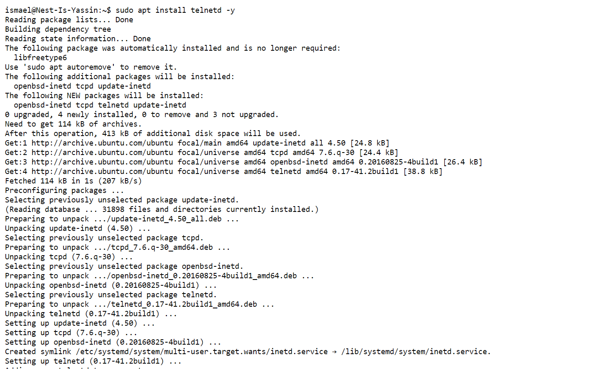
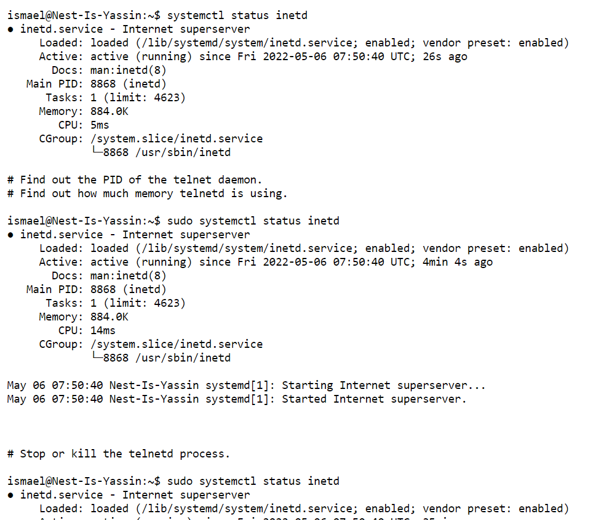
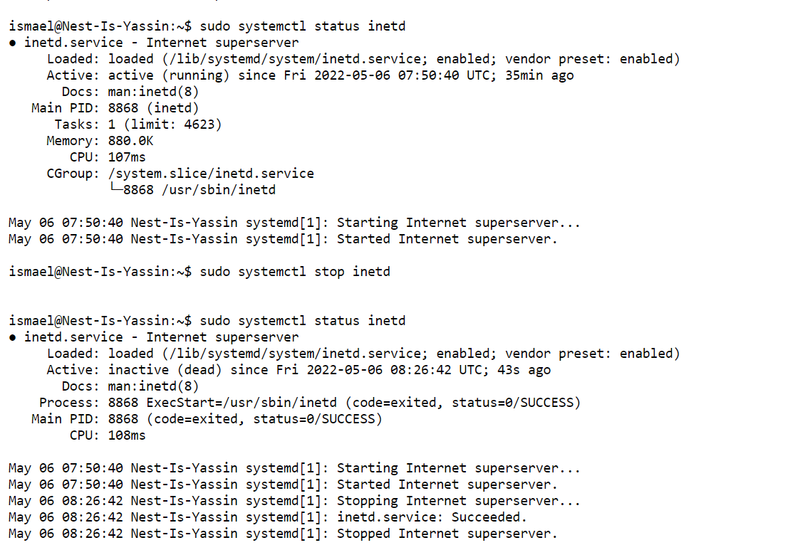

## Processes

Daemons  runs in the background and is not interactive.

Services may be interactive and  is run & used by users (vim).
Service also responds to requests from programs.

SSH helps with connecting to a linux machine so to start SSH services youĺl need to start ssh daemon. So before ssh came there was telnet (did the same thing as ssh but not encrypted)

A process is an instance of running code. All code is stored in files somewhere on the system. In order to find these files, Linux will look in the $PATH variable. Every process has its own PID (Process ID) number.

Processes are stored in systemd, when the system is aware of them, they are called **units**

units can have different suffixes based on their functionality (.service, .socket, .timer etc)

#### Key Terms

SSH = secure shell

pgrep PROCESSNAME == command to retrieve PID based on process name

ps aux | grep -i PARTIALNAME == combine ps aux and grep if you don't know the full name (ps == Process status)

free (command for overview of used and available RAM and disk memory)

top (command to check memory usage for all processes in Linux)

Information about memory usage is stored in /proc/meminfo. This is not a real file, but a virtual file that provides realtime information.

/proc/$pid/status gives info about a specific pid

killall PROCESSNAME (kills process with this name)

# exercise

#### Start the telnet daemon.

First install telnet

             
#### Find out the PID of the telnet daemon.
#### Find out how much memory telnetd is using.

#### Stop or kill the telnetd process.

#### Challenges overcame
Learn about telnet and stopping telnet.

## Sources
https://www.javatpoint.com/linux-telnet-command
