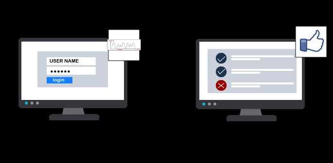
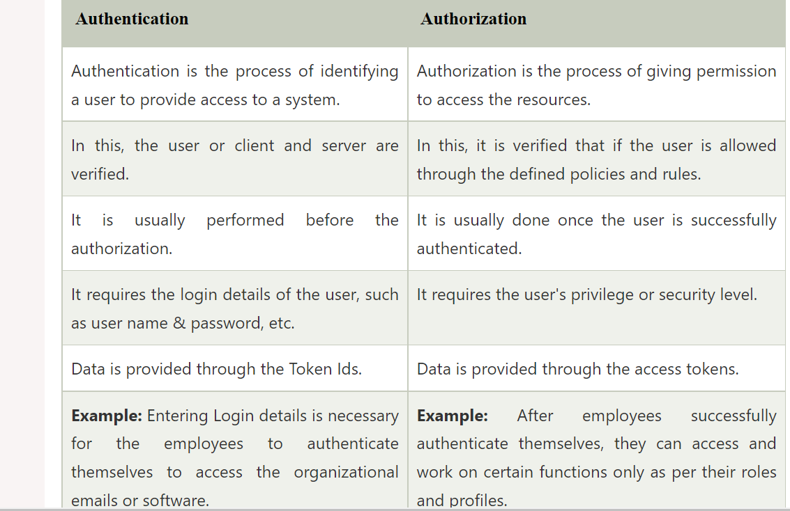

# Identity and Access Management

### Introduction
Security goes in two steps: 

#### Authentication 

It's to identify a person by aasuring that the person is the same as what he/she/ is claiming to be.

It is used by both server(system) and client(person). The server uses authentication when someone wants to access the information, and the server needs to know who is accessing the information. The client uses it when he wants to know that it is the same server that it claims to be.

Authentication does not ensure what tasks under a process one person can do, what files he can view, read, or update(done by authorization). It mostly identifies who the person or system is actually.

Authentication techniques
1. Password-based authentication

It is the simplest way of authentication. It requires the password for the particular username. If the password matches with the username and both details match the system's database, the user will be successfully authenticated.

2. Passwordless authentication

In this technique, the user doesn't need any password; instead, he gets an OTP (One-time password) or link on his registered mobile number or phone number. It can also be said OTP-based authentication.

3. 2FA/MFA

2FA/MFA or 2-factor authentication/Multi-factor authentication is the higher level of authentication. It requires additional PIN or security questions so that it can authenticate the user.

4. Single Sign-on

Single Sign-on or SSO is a way to enable access to multiple applications with a single set of credentials. It allows the user to sign-in once, and it will automatically be signed in to all other web apps from the same centralized directory.

5. Social Authentication

Social authentication does not require additional security; instead, it verifies the user with the existing credentials for the available social network.

#### Authorization. 

Is to give someone the access to do something, so it is a way to check if the user has a perimission to use a resource (files) or not.

It defines that what data and information one user can access. It is also said as AuthZ.

The authorization usually works with authentication so that the system could know who is accessing the information.

Authorization is not always necessary to access information available over the internet. Some data available over the internet can be accessed without any authorization (like research articles).

Authorization Techniques;

Role-based access control
RBAC or Role-based access control technique is given to users as per their role or profile in the organization. It can be implemented for system-system or user-to-system.

JSON web token
JSON web token or JWT is an open standard used to securely transmit the data between the parties in the form of the JSON object. The users are verified and authorized using the private/public key pair.

SAML
SAML stands for Security Assertion Markup Language. It is an open standard that provides authorization credentials to service providers. These credentials are exchanged through digitally signed XML documents.

OpenID authorization
It helps the clients to verify the identity of end-users on the basis of authentication.
OAuth
OAuth is an authorization protocol, which enables the API to authenticate and access the requested resources.

### Exercises
The difference between authentication and authorization.

Here are the differences between Authentication and Authorization;

The three factors of authentication and how MFA improves security.

According to the security level and type of application, there are different type of authentication factors:

a. Single-Factor Authentication;

This needs just a username and a password to allow a user access a system (e.g login to email/social media platforms).

b. Two-Factor Authentication;

This is a two step verification to identify a user. 
It does not require only a username and password but also needs the unique information that only the particular user knows, such as first school name, a favorite destination( e.g. when a user is resetting email password). Apart from this, it can also verify the user by sending a unique link on the user's registered number or email address.

c. Multi-factor Authentication
This is the most secure and advanced level of authorization. It improves securty by requiring two or more than two levels of security from different and independent categories. For aexample using Google authenticator app together with the user login credentials(username&password) to sign in the AWS console. This type of authentication is usually used in financial organizations, banks, and law enforcement agencies. This can eliminate any data exposure from the third party or hackers.

What the principle of least privilege is and how it improves security.

### Challenges 

### sources

https://www.javatpoint.com/authentication-vs-authorization

https://www.sailpoint.com/identity-library/difference-between-authentication-and-authorization/#:~:text=Simply%20put%2C%20authentication%20is%20the,a%20user%20has%20access%20to.
