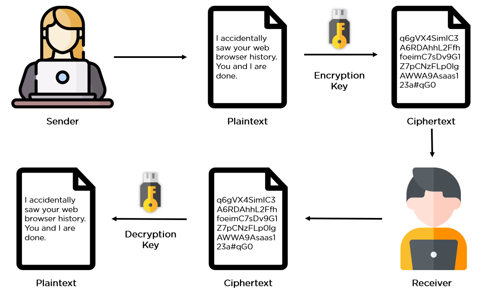

# Symmetric encryption

Introduction

Throughout history humanity has come up with many ciphers to encode information. Most of these are symmetric ciphers, the most famous one being the Caesar cipher.

### Key terminologies:

**Encryption**:

Is the process of converting data from a readable format to a scrambled piece of information. This is done to prevent prying eyes from reading confidential data in transit. Encryption can be applied to documents, files, messages, or any other form of communication over a network.

**Plaintext or cleartext** is the data that needs to be encrypted. The plaintext needs to be passed via some encryption algorithms, which are basically mathematical calculations to be done on raw information. There are multiple encryption algorithms, each of which differs by application and security index.

**ciphertext** is converting the plaintext into encrypted piece of data by using **Encryption key** and a suitable **encryption algorithm**.

Instead of sending the plaintext to the receiver, the ciphertext is sent through insecure channels of communication. 

symmetrical encryption:

Cipher:

Decipher:

cryptography; 

It refers to the method used to protect sensitive information. 

So this means that it's mainly used to encrypt and decrypt data or messages that cannot be deciphered by unauthorized access. 

It deploys the use of scrambled or distorted symbols. It is simply used to provide extra security to ensure that only authorized users can understand the message. 

 

Requirements
The Slack channel your share with your group
A peer

### Exercise
##### Find two more historic ciphers besides the Caesar cipher.

###### Find two digital ciphers that are being used today.

##### Send a symmetrically encrypted message to one of your peers via the public Slack channel. They should be able to decrypt the message using a key you share with them. Try to think of a way to share this encryption key without revealing it to everyone. 

You are not allowed to use any private messages or other communication channels besides Slack. Analyse the shortcomings of this method.

#### Challenges overcame:

Learning about cryptography

### Sources

https://www.geeksforgeeks.org/difference-between-cryptography-and-cyber-security/

https://www.simplilearn.com/data-encryption-methods-article

