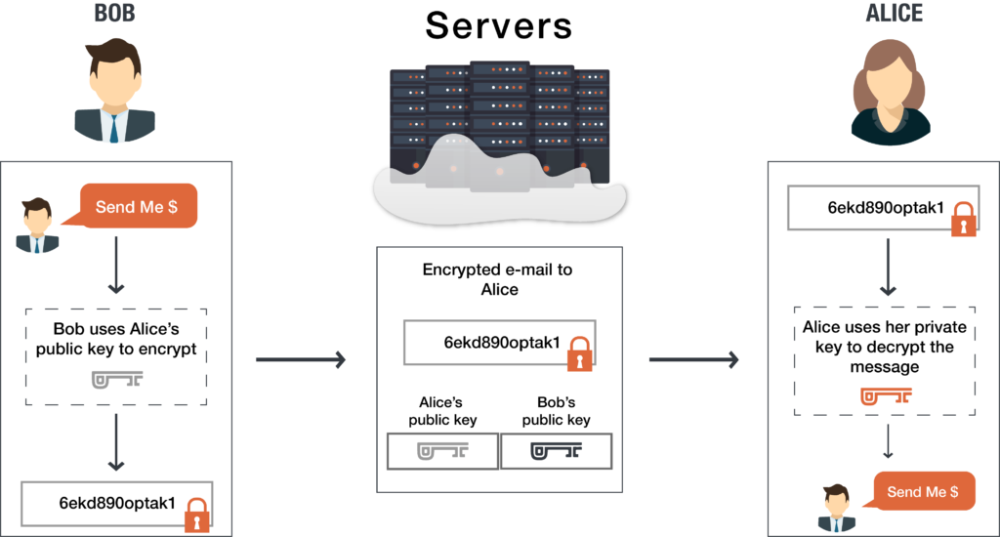

# Asymmetric encryption

### Introduction

The previous assignment introduced you to cryptography and symmetric encryption. In the previous exercise, you shared your encryption key with the recipient of your message. This means that anyone who has the key can decrypt the message.

Asymmetric encryption solves this issue. Instead of 1 key, you get 2: A public key, and a private key.

 
**Asymmetrical encryption**:

Also known as Public-Key Cryptography, encrypts and decrypts the data using two separate cryptographic asymmetric keys. These two keys are known as a “public key” and a “private key” which are mathematically linked.

In public key cryptography, every public key matches to only one private key. 

Together, they are used to encrypt and decrypt messages. If you encode a message using a person’s public key, they can only decode it using their matching private key.

**Difference between Public keys and private keys**:

*Puclic keys* can be looked up by everyone anyone  and share it widely. In asymmetric encryption, public keys can be shared with everyone in the system. Once the sender has the public key, he uses it to encrypt his message.

*Private keys*  can be seen as  the key to the front door of a business where only you have a copy. 

So a message encrypted with the public key cannot be decrypted without using the corresponding private key.

**Generating public and private keys**
The public and private key  are really large prime numbers that are mathematically related to one another. Being related in this case means that whatever is encrypted by the public key can only be decrypted by the related private key.
 

 
**These are some of the  well-known mathematical algorithms used to produce the public and private key**. 
 

1. Rivest-Shamir-Adelman (RSA) – Oldest of the public-private key cryptography systems. Frequently used to transmit shared keys for symmetric key cryptography.

2. Digital Signature Standard (DSS) – a Federal Information Processing Standard specifying the algorithms that can be used to generate digital signatures used by NIST. 

3. Elliptic curve cryptography (ECC)– As its name implies, ECC relies on elliptic curves to generate keys. Often used for key agreement and digital signatures. At PreVeil, we use elliptic-curve cryptography’s Curve-25519 and NIST P-256.

Requirements
The Slack channel your share with your group
A peer
A key pair generator like https://travistidwell.com/jsencrypt/demo/

### Exercise

#### Generate a key pair.

Send an asymmetrically encrypted message to one of your peers via the public Slack channel. They should be able to decrypt the message using a key you share with them. The recipient should be able to read the message, but it should remain a secret to everyone else.
You are not allowed to use any private messages or other communication channels besides Slack. Analyse the difference between this method and symmetric encryption.

### Sources

https://www.preveil.com/blog/public-and-private-key/
