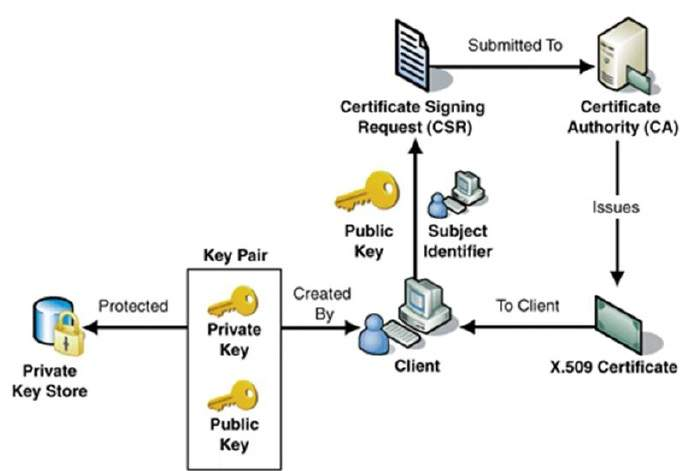

# Public Key Infrastructure

### Public Key Infrastructure (PKI);

 is a set of roles, policies, hardware, software and procedures needed to create, manage, distribute, use, store and revoke digital certificates and manage public-key encryption.

 The **importance of PKI** is this combination of encryption and authentication makes trustworthy online communication possible.

It consists of **three entities** that assure you can communicate securely over an insecure network like the public internet.

PKI facilitates trusting the actions or outputs of entities, be they people or computers. 

PKI objectives respect one or more of the following capabilities: Confidentiality, Integrity and Authenticity (CIA)

There have traditionally been three approaches to getting this trust: certificate authorities (CAs), web of trust (WoT), and simple public key infrastructure (SPKI).

1. A certificate authority, which issues digital certificates, signs them with its own public key, and stores them for reference.
2. A registration authority, which verifies the identities of those requesting digital certificates. A CA can act as its own registration authority or can use a third party to do so.
A certificate database that stores both the certificates and metadata about them—most importantly, the period of time for which the certificate is valid.
A certificate policy outlining the PKI's procedures, which allows outsiders to judge how trustworthy the PKI is.

1. X.509 is the standard which defines the process in which a PKI should function. 

Hence digital certificates are sometimes also referred to as 
X.509 certificates.

Digital certificates are based on the ITU standard X.509 which defines a standard certificate format for public key certificates and certification validation. 

There are many ways of implementing a PKI, not all of them comply with the X.509 standard.

Requirements
Your Linux machine
An internet browser

Exercise
Create a self-signed certificate on your VM.

Analyze some certification paths of known websites (ex. techgrounds.nl / google.com / ing.nl).

Find the list of trusted certificate roots on your system (bonus points if you also find it in your VM).

### Sources

https://www.tutorialspoint.com/cryptography/public_key_infrastructure.htm

https://www.csoonline.com/article/3400836/what-is-pki-and-how-it-secures-just-about-everything-online.html

https://en.wikipedia.org/wiki/Public_key_infrastructure