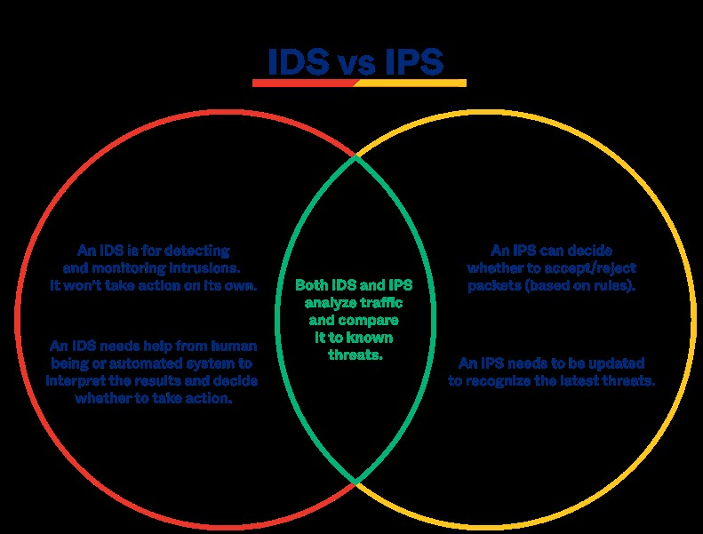
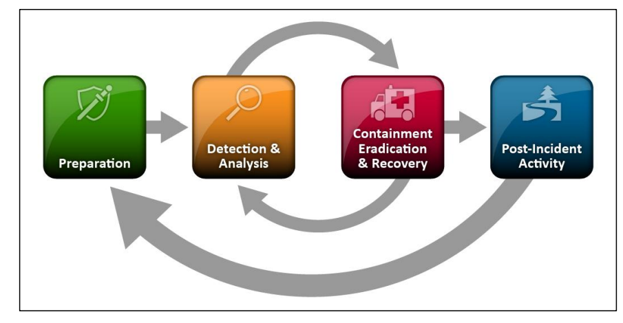
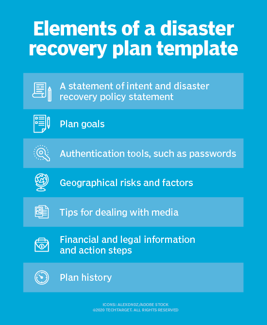

# Detection, response and analysis

Introduction

So far, we’ve mostly looked at the prevention of attacks. While you want to prevent as many attacks as possible, some attacks will slip through your prevention systems. The most common method of getting malicious software (malware) into a network is through social engineering.

When getting hit with an attack, there are usually three steps to follow: **Detection, response, and analysis**.

1. Detecting an (attempted) attack is the first step to stopping it and to preventing future attempts. Tools like Wireshark can help analyse a network to detect anomalies. 
Intrusion detection systems (IDS) and intrusion prevention systems (IPS) are also used for this purpose.

2. The first thing to do in response to a detected attack is trying to contain the damage. 

Depending on the kind of attack, the way you do this might differ. After the attack is contained, you can try to figure out the root cause of the attack, so that you can stop it. 

3. Finally, you enter the recovery phase, where you try to get all systems back online and you take stock of the damage done.

It is vitally important to have a plan in place for how to respond when an attack happens.
In the analysis phase, you document what you learned and harden your systems so that such an attack cannot happen again. Sometimes this can be as simple as updating the OS on a server.

Response, and analysis are part of a disaster recovery plan. This plan is an important part of a bigger business continuity plan. When a disaster strikes and infrastructure goes offline, a business could be done for. There are many strategies when it comes to mitigating a disaster. From just having a cold backup, to a redundant site.
For these strategies it is always important to keep track of the following metrics: How much data is lost on incident (Recovery Point Objective; RPO), how long it takes to be back online (Recovery Time Objective; RTO), and cost.

Requirements

# Key terminologies:

#### Network intrusion: 

Is any unauthorized activity on a computer network. Detecting an intrusion depends on having a clear understanding of network activity and common security threats.

#### Common network vulnerabilities include:

- Malware: 

Also known as malicious software, is any program or file that is harmful to a computer user. Types of malware include computer viruses, worms, Trojan horses, spyware, adware and ransomware. 

- Social engineering attacks:

Is an attack vector that exploits human psychology and susceptibility to manipulate victims into divulging confidential information and sensitive data or performing an action that breaks usual security standards. Common examples of social engineering include phishing, spear phishing, and whaling attacks.

- Outdated or unpatched software and hardware: 

This can have known vulnerabilities. A vulnerability is a weakness which can be exploited by a cyber attack to gain unauthorized access to or perform unauthorized actions on a computer system. Wormable vulnerabilities like the one that led to the WannaCryransomware are particularly high risk.

- Data storage devices: Portable storage devices like USB and external hard drives can introduce malware into the network. 

#### IDS:

An intrusion detection system (IDS) monitors traffic on your network, analyzes that traffic for signatures matching known attacks, and when something suspicious happens, you're alerted. In the meantime, the traffic keeps flowing. 

This system might detect problems with:

1. Patterns. The technology flags unusual requests, very large packet sizes, or anything that seems out of the ordinary for your system at that time.

2. Prior attacks. The technology flags anything on your server that's been used in a known and successful attack on another server.

3. Machine learning. The system picks up information about everything that happens on your server in an average day, and that data helps to refine the protections in place. 

#### IPS:

An intrusion prevention system (IPS) also monitors traffic. But when something unusual happens, the traffic stops altogether until you investigate and decide to open the floodgates again.

An IPS monitors the network for suspicious activity or attacks in progress. When a suspicious activity is spotted, you're alerted. But in the interim, the system springs to action. It might:

1. Close sessions; It can identify the entry point for the unusual activity and block it from continuing. That might mean terminating the TCP session, blocking an IP address, or some similar step.

2. Strengthen firewalls; The system might identify the gap in the firewall that allowed the attack to enter. A change in programming could prevent something similar in the future.

3. Clean up; The system can scan for damaged or malicious content within the server and remove it. 

#### Differences between IDS and IPS are:

- Response. An IDS is passive, while an IPS is an active control system. You must take action after an IDS alerts you, as your system is still under attack.

- Protection. Arguably, an IDS offers less help when you're under threat. You must figure out what to do, when to do it, and how to clean up the mess. An IPS does all of this for you.

- False positives. If an IDS gives you an alert about something that isn't troublesome at all, you're the only one inconvenienced. If an IPS shuts down traffic, many people could be impacted. 

Many companies avoid the IDS vs. IPS problem by **deploying both solutions(IDS&IPS)**  they could use the IPS for active network security while the IDS gives you a deep understanding of how the traffic moves across your network. 

A solution like this gives the companies information they can build on to keep their entire system safe. But they'll also avoid letting an attack go unchecked.

Hack response strategies:

IR: incident response (IR) plan.The first point is to make this IR plan.

One of the standard guidance for security incident handling is the National Institute of Standards and Technology (NIST, USA) SP 800-61. which specifies the following areas;

- Preparation – Planning in advance how to handle and prevent security incidents.

- Detection and analysis – Encompasses everything from monitoring potential attack vectors to looking for signs of an incident, to prioritization.

- Containment, eradication, and recovery – Developing a containment strategy, identifying the hosts and systems under attack, mitigating the effects, and having a plan for recovery.

- Post-incident activity – Reviewing lessons learned and having a plan for evidence retention.

 

#### The concept of systems hardening:

System hardening is the process of securing a server or computer system by minimizing its attack surface, or surface of vulnerability, and potential attack vectors. It’s a form of cyberattack protection that involves closing system loopholes that cyberattackers frequently use to exploit the system and gain access to users’ sensitive data.

There are five main types of system hardening:

- Server hardening

- Software application hardening

- Operating system hardening

- Database hardening

- Network hardening

For example, system hardening best practices outlined by the NIST in Special Publication (SP) 800-123, a document focused entirely on system hardening, include:

- Establishing a system security plan

- Patching and updating the OS

- Removing or disabling unnecessary services, applications, and network protocols

- Configuring OS user authentication

- Configuring resource controls appropriately

- Selecting and implementing authentication and encryption technologies

Different types of disaster recovery plans(DRP) options:

(DRP) is a documented, structured approach that describes how an organization can quickly resume work after an unplanned incident.

Types of disaster recovery plans(DRP):

- Data center DRP

- Data back-up DRP

- virtual DRP (entire IT infrastructure is backed up on cloud servers).

- DRaaS; Disaster recovery as a service. This is a complete copy of a company's IT infrastructure in a 3rd party cloud environment.

- Hot site DRP; a form of DRaaS for  like medical facilities, nursing homes, and financial institutions, that includes setting up a second physical facility filled with identical IT infrastructure. 

- Cold site DR; slightly less-expensive alternative to a hot site. This involves renting space that can be used if needed.

RPO:

The recovery point objective (RPO) describes the age of files that must be recovered from data backup storage for normal operations to resume.

RTO:

The recovery time objective (RTO) describes the amount of time critical applications can be down, typically measured in hours, minutes or seconds. 

Failover:

# Exercise

A Company makes daily backups of their database. The database is automatically recovered when a failure happens using the most recent available backup. The recovery happens on a different physical machine than the original database, and the entire process takes about 15 minutes.

#### What is the RPO of the database?

Since the company makes daily(24hrs) backups in a different physical machine, this is how far the last backup took place. So the RPO  is 24hour. 

An automatic failover to a backup web server has been configured for a website. Because the backup has to be powered on first and has to pull the newest version of the website from GitHub, the process takes about 8 minutes. 

#### What is the RTO of the website?

8 minutes because this is the time (RTO) or how long it takes to get the last version(roll back) from github.
### Challenges overcame

Not that much just alot of reading and understanding how RTO and RPO work.

### Sources

https://www.okta.com/identity-101/ids-vs-ips/

https://www.upguard.com/blog/ids-vs-ips

https://nvlpubs.nist.gov/nistpubs/specialpublications/nist.sp.800-61r2.pdf

https://www.msp360.com/resources/blog/how-to-respond-to-cyberattacks/

https://www.trentonsystems.com/blog/system-hardening-overview

https://www.geeksforgeeks.org/what-is-system-hardening/

https://dynamixsolutions.com/types-disaster-recovery-plans/

https://www.techtarget.com/searchdisasterrecovery/definition/disaster-recovery-plan
