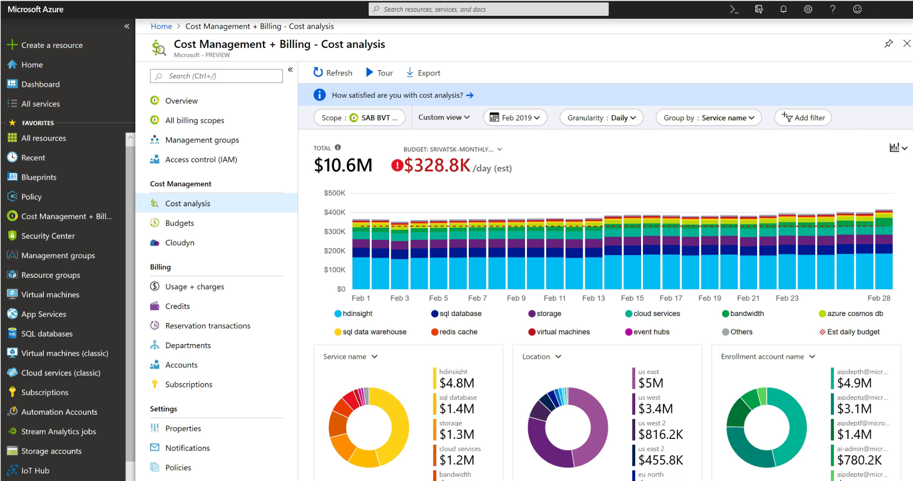

# Cost Management + Billing

### Introductie:

#### Key Terminolgie:

Opex = Operational expenditure, this where you pay for what you use. Think of it like a utility bill (water&energy).

Capex = Capital expenditure, where you pay upfront, It's fixed (sunk cost).

`Pay-as-you-go` subscription;
Where you pay for what you've used.

Azure geeft de volgende principes om succesvol je kosten te reduceren:

- Plan (Planning)
- Zichtbaarheid (Visibility)
- Verantwoording (Accountability)
- Optimalisatie (Optimization)
- Iteratie (Iteration)

De Total Cost of Ownership (TCO) wordt gebruikt om te berekenen hoeveel een infrastructuur kost als het op de traditionele manier gehost wordt. Met de TCO-calculator kan je de kosten van een traditionele infrastructuur vergelijken met de kosten voor dezelfde infrastructuur op Azure.

#### Key principle and best practices on cost management:

- Understand the fundermentals of pricing

- Start early with cost optimization

- Maximize the power of flexibility

- Use the right pricing model for the job.

Benodigdheden:
Je Azure Cloud omgeving (link).

Azure documentatie

Bestudeer:
De Azure principes voor kostenmanagement
De voorwaarden van de `Free subscription`
Het verschil tussen CAPEX en OPEX.
De TCO-calculator

### Opdracht:

#### Maak een alert aan waarmee je eigen.

#### Begrijp de opties die Azure aanbiedt om je uitgaven in te zien.

Azure Monitor includes functionality for the;

- collection and analysis of log data (billed by data ingestion, retention, and export).

- monitoring of availability via web tests, export of platform logs data from Azure resources, collection of metrics, alerts, and notifications. 

- Features of Azure Monitor that are automatically enabled such as collection of standard metrics and activity logs are provided at no cost. 

- Also available at no additional cost are the advanced monitoring capabilities that use your ingested data (see Insights and core solutions).

### Sources:

https://azure.microsoft.com/en-us/pricing/details/monitor/

https://azure.microsoft.com/nl-nl/services/cost-management/#overview

https://spot.io/resources/azure-pricing/azure-cost-management-4-ways-to-optimize-azure-costs/